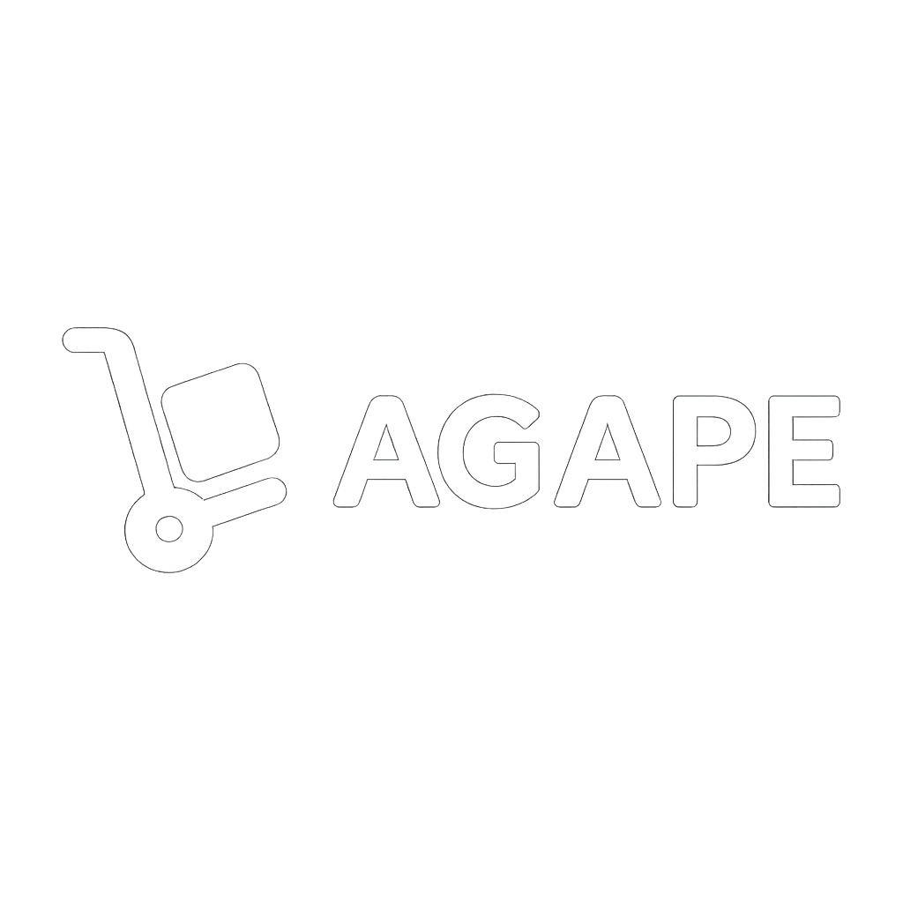

# Agape - Sistema de Gerecniamento de Estoque

# Objetivos

-   Facilitar o gerenciamento de estoque para pequenas e médias empresas
-   Oferecer uma interface moderna e intuitiva
-   Automatizar processos de controle de entrada e saída
-   Fornecer alertas inteligentes para gestão eficiente
-   Garantir escalabilidade e performance

## Funcionalidades

### Autenticação e Segurança

-   [x] Sistema de cadastro e login de usuários
-   [x] Autenticação segura com validação
-   [x] Redefinição de senha via email
-   [x] Proteção de rotas e sessões

### Gestão de Estoque

-   [x] Controle completo de entrada e saída de produtos
-   [x] Gerenciamento de quantidades em tempo real
-   [x] Sistema de alertas para estoque baixo
-   [x] Ordem automática de reposição
-   [x] Filtros avançados de produtos
-   [x] Gestão integrada de preços

### Interface e Experiência

-   [x] Design responsivo e intuitivo
-   [x] Interface moderna com paleta de cores consistente
-   [x] Animações suaves e transições
-   [x] Navegação otimizada para desktop e mobile
-   [x] Sistema de notificações visuais

### Comunicação

-   [x] Sistema de notificações por email
-   [x] Formulário de contato integrado
-   [x] Alertas automáticos do sistema

## Tecnologias Utilizadas

### Backend

-   **Laravel 11.x** - Framework PHP robusto e moderno
-   **PHP 8.2+** - Linguagem server-side
-   **SQLite** - Banco de dados leve e eficiente
-   **Composer** - Gerenciador de dependências PHP

### Frontend

-   **HTML5** - Estrutura semântica
-   **CSS3** - Estilização moderna com variáveis CSS
-   **JavaScript ES6+** - Interatividade e dinamismo

### Ferramentas de Desenvolvimento

-   **Vite** - Build tool moderna e rápida
-   **Artisan** - CLI do Laravel
-   **Git** - Controle de versão

## Estrutura do Projeto

```
agape-laravel/
├── app/
│   ├── Http/Controllers/     # Controladores da aplicação
│   ├── Models/              # Modelos Eloquent
│   └── Providers/           # Service Providers
├── database/
│   ├── migrations/          # Migrações do banco de dados
│   ├── seeders/            # Seeders para popular dados
│   └── database.sqlite     # Banco de dados SQLite
├── public/
│   └── frontend/
│       ├── css/            # Estilos CSS
│       ├── js/             # Scripts JavaScript
│       └── img/            # Imagens e assets
├── resources/
│   └── views/              # Templates Blade
│       ├── index.blade.php
│       ├── login.blade.php
│       ├── register.blade.php
│       └── contato.blade.php
├── routes/
│   └── web.php             # Rotas da aplicação
└── storage/                # Armazenamento de arquivos
```

## Responsividade

O sistema foi desenvolvido com abordagem **mobile-first**, garantindo uma experiência otimizada em:

-    **Mobile**: < 768px
-    **Tablet**: 768px - 1024px
-    **Desktop**: > 1024px

## Funcionalidades Implementadas

### Checklist da Segunda Entrega

-   [x] **Design Intuitivo** - Interface moderna e responsiva
-   [x] **Cadastro e Login** - Sistema completo de autenticação
-   [x] **Redefinição de Senha** - Recovery via email
-   [x] **Notificações por Email** - Sistema integrado de comunicação
-   [x] **Gerenciamento de Estoque** - Entrada e saída de produtos
-   [x] **Ordem Automática** - Reposição inteligente
-   [x] **Filtragem de Produtos** - Busca e filtros avançados
-   [x] **Gestão de Quantidades** - Controle em tempo real
-   [x] **Alertas de Estoque Baixo** - Notificações automáticas
-   [x] **Gestão de Preços** - Controle financeiro integrado

## Equipe de Desenvolvimento

| Nome                | Matrícula | 
| ------------------- | --------  | 
| **Daniel Heber**    | 12301647  | 
| **Daniel Pereira**  | 12303011  | 
| **Gabriel Dias**    | 12301620  | 
| **Gabriel Lacerda** | 12302457  |
| **Matheus Vieira**  | 12302988  | 

**Turma**: 3E1

## Licença

Este projeto está sob a licença MIT. Veja o arquivo [LICENSE](LICENSE) para mais detalhes.

<div align="center">
  Desenvolvido com ❤️ pela equipe Agape
  
  **© 2024 Agape - Sistema de Gestão de Estoque**
</div>que

<div align="center">
  
  
  **Gestão de estoque descomplicada, eficiente e acessível**
  
  [](https://laravel.com)
  [](https://php.net)
  [](https://developer.mozilla.org/en-US/docs/Web/JavaScript)
  [](https://www.w3.org/Style/CSS/)
</div>

## Sobre o Projeto

O **Agape** é um sistema completo de gestão de estoque desenvolvido para simplificar o controle de produtos, oferecendo uma interface intuitiva e funcionalidades robustas para empresas de todos os portes. Com o Agape, você tem controle total dos seus produtos, mais organização no dia a dia e decisões mais rápidas — tudo na palma da sua mão.Projeto\*\*: Agape